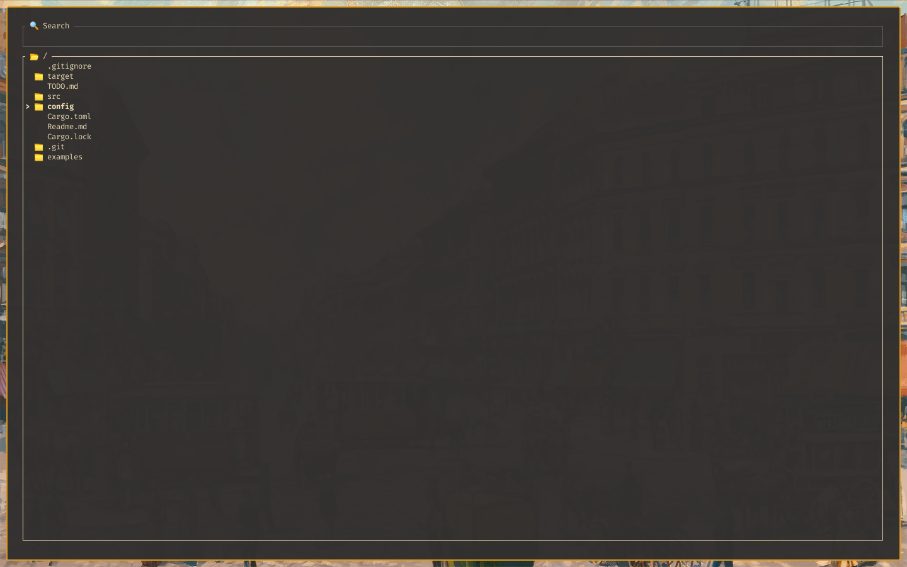

# Navigator



Navigator allows you to navigate through heavy output with ease.
You can feed it a string and it gives you in return a beautiful interface from where you can select or search.

It differentiates itself by providing support for folders.
Simply because folders allow for much cleaner and simpler navigation.

Btw. it's a very immature project.<br>
So don't expect any ✨ bling ✨ (for now).

- [Installation](#installation)
- [Usage](#usage)
- [Shortcuts](#shortcuts)
- [Configuration](#configuration)
- [Dependencies](#dependencies)

### Installation

Simpy clone and install the package locally with cargo.
Cargo probably installs the binary to the default locations `~/.cargo/bin`.
Make sure to put that in your path so you can call it.

``` bash
git clone https://github.com/OrangeFran/navigator.git
cargo install --path navigator
```

### Usage

There are some flags you can use. Look at them with `--help`.
It's pretty basic for now. You can pass in a string to process or read from standard input with `--stdin`.

After the string is read, it get's parsed into a list of folders and files.
By default it seperatres folders and subfolders with a tab e.q.
```
file
folder
    file
```
You can even use nested folder. It should all work.
There are also some tests that prove it. Run `cargo test` for that.
If there are errors, please open an issue.

You can specify a custom seperator with -s or --sep.

For some useful examples, take a look at the examples folder.
This tool is mostly built for people who want to script stuff.
But you can sure use it for everything you want to.
If you'd like to share a cool script, you can make a pull request.

### Shortcuts

Navigator is a terminal-user-interface, so it relies on shortcuts.
But it's a simple tool, so there is no need to panic. If you know vim, you're probably good to go.

Here's a list:

* **h**
    * go back one folder (if possible)
* **l**
    * enter a folder (if possible)
* **j**
    * scroll down
* **k**
    * scroll up
* **q**     
    * quit
* **/**     
    * search for something
* **esc**   
    * switch back to the list
* **enter** 
    * return the selected element

### Configuration

Personally I really like customisation, but I don't think it makes a lot of sense 
focusing on it in such a young project. Fortunately you can at least change the colors.

There is a default config file in at config/config.toml.
It is filled with the default options. 
Please excuse the fact that you have to include at least this

``` toml
selector = "> "
lame = false

[theme.selected]
[theme.default]
```

in you config file to work. I'm working on making everything optional.
But I don't really like my implementation. I'd be happy to take suggestions.

You can see all the options here.

``` toml
selector = "> "
lame = false

[theme.selected]
fg = [255, 255, 255]
# bg = ...

[theme.default]
fg = [40, 40, 40]
# bg = ...
```

### Dependencies

[tui-rs](https://github.com/fdehau/tui-rs)<br>
[termion](https://github.com/redox-os/termion.git)

[toml](https://github.com/alexcrichton/toml-rs)<br>
[serde](https://github.com/serde-rs/serde)
